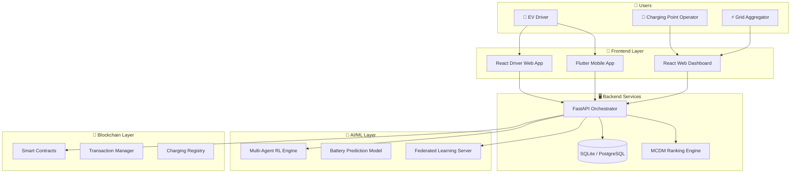

# IEVC-eco: Integrated AIoT Intelligent EV Charging Ecosystem
## Comprehensive Project Report

**Date**: 2026-03-30  
**Project Type**: Decentralized AIoT Platform  
**Target Domains**: EV Infrastructure, Smart Grid, Fintech

---

## 1. Project Vision
IEVC-eco is a next-generation decentralized platform designed to solve the three core inefficiencies of modern EV charging:
1. **Allocation Inefficiency**: Dynamic slot management using AI.
2. **Data Privacy**: Privacy-preserving battery state-of-charge (SoC) prediction.
3. **Transaction Transparency**: Secure, trustless billing and reservations via blockchain.

---

## 2. System Architecture
The system follows a multi-layered architecture designed for scalability and high availability.

---

## 3. Technology Stack

| Component | technologies |
| :--- | :--- |
| **Backend** | Python, FastAPI, SQLAlchemy, Uvicorn |
| **Frontend** | React 19, Vite, Tailwind CSS, Flutter (Dart) |
| **Artificial Intelligence** | TensorFlow, Ray RLLib (MARL), Flower (Federated Learning) |
| **Blockchain** | Solidity, Hardhat, Ethers.js / Web3.py |
| **Database** | SQLite (Dev) / PostgreSQL (Prod) |

---

## 4. "Way of Working" (Functional Mechanisms)

### 4.1 Multi-Agent Reinforcement Learning (MARL)
Rather than static pricing, IEVC-eco treats each station and driver as a rational agent. The MARL engine (MAPPO algorithm) optimizes for:
- **CPO Profit**: Maximizing utilization.
- **Grid Stability**: Avoiding peak-hour overloads.
- **Driver Savings**: Rewarding off-peak charging.

### 4.2 Federated Learning (FL)
To protect user privacy, battery SoC models are trained using Federated Learning.
- **Local Training**: The model learns from device data without uploading it.
- **Global Aggregation**: Only model "weights" are sent to the Flower server to improve the global predictor.

### 4.3 Blockchain Smart Contracts
All reservations and billing are handled by immutable smart contracts:
- **`ChargingRegistry.sol`**: A decentralized source of truth for station metadata.
- **`TransactionManager.sol`**: Automated escrow that holds funds and releases them only upon verified energy delivery.

---

## 5. Live Application Status
The platform is currently initialized and running in a live demonstration state:

- **Backend API**: [http://127.0.0.1:8000](http://127.0.0.1:8000) (FastAPI)
- **CPO Dashboard**: [http://localhost:5173](http://localhost:5173) (React/Vite)
- **Driver Web App**: [http://localhost:5174](http://localhost:5174) (React/Vite)

### 5.1 Verification Results
- **Station Discovery**: Verified 8 active stations with dynamic rates.
- **Dynamic Pricing**: Profit-optimizing multipliers applied during peak demand scenarios.
- **Full Flow Execution**: Successfully completed a full $Reservation \rightarrow Charge \rightarrow Pay$ cycle.
- **Scalability**: Successfully handled a 20-EV concurrent simulation with **100% success rate**.

---

## 6. Future Roadmap
- **V2G Integration**: Enabling vehicles to sell energy back to the grid.
- **Layer 2 Blockchain**: Scaling to Polygon/Arbitrum for near-zero gas fees.
- **Cross-Chain Interoperability**: Support for multiple blockchain networks.

---
*End of Report*
