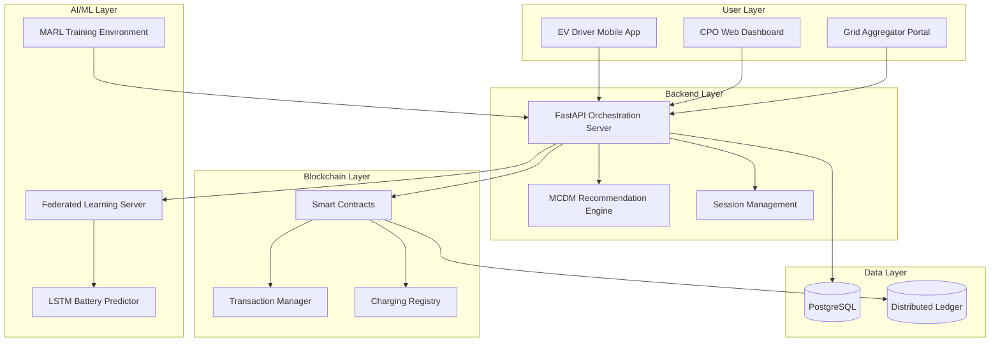
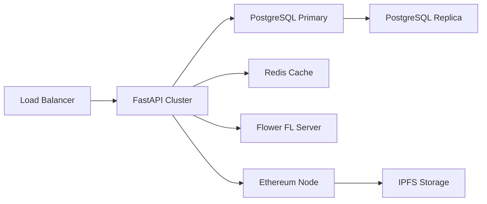

# IEVC-eco: Integrated AIoT Intelligent EV Charging Ecosystem
## Project Presentation Report

**Project Type:** Decentralized Software Platform  
**Domain:** Electric Vehicle Infrastructure, AIoT, Blockchain  
**Timeline:** 12 Weeks (3 Months)  
**Date:** February 2026

---

## Executive Summary

IEVC-eco is an innovative decentralized software platform designed to revolutionize electric vehicle (EV) charging infrastructure through the integration of cutting-edge technologies. The platform addresses three critical challenges in the EV ecosystem:

1. **Inefficient charging slot allocation** → Solved with Multi-Agent Reinforcement Learning (MARL)
2. **Privacy concerns in battery data** → Addressed with Federated Learning
3. **Trust issues in billing and reservations** → Resolved with Blockchain technology

### Key Value Propositions

| Stakeholder | Pain Point | Solution |
|------------|------------|----------|
| **EV Drivers** | High charging costs, long wait times, privacy concerns | AI-powered recommendations, dynamic pricing, local ML processing |
| **Charging Point Operators (CPOs)** | Revenue optimization, demand forecasting | MARL-based dynamic pricing, real-time analytics |
| **Grid Aggregators** | Load balancing, demand prediction | Predictive ML models, distributed load management |

---

## 1. Problem Statement

### Current Challenges in EV Charging Infrastructure

#### 1.1 Inefficient Resource Allocation
- Static pricing models fail to balance supply and demand
- Peak-hour congestion leads to long wait times
- Underutilization during off-peak hours reduces CPO revenue

#### 1.2 Privacy Concerns
- Centralized battery data collection exposes sensitive user patterns
- Location tracking raises privacy issues
- Traditional ML requires data aggregation in central servers

#### 1.3 Trust and Transparency Issues
- Opaque billing systems
- Reservation disputes between drivers and CPOs
- Lack of interoperability across charging networks

### Market Opportunity
- **Global EV Market Growth:** 40% CAGR (2024-2030)
- **Charging Infrastructure Gap:** 10:1 EV-to-charger ratio in many regions
- **Smart Grid Integration:** $100B+ market by 2030

---

## 2. Proposed Solution

### 2.1 System Architecture



### 2.2 Core Technologies

#### Multi-Agent Reinforcement Learning (MARL)
- **Purpose:** Dynamic pricing and load balancing
- **Agents:** EV drivers, CPOs, Grid operators
- **Framework:** Ray RLLib / PettingZoo
- **Objective:** Nash equilibrium for optimal pricing

#### Federated Learning
- **Purpose:** Privacy-preserving battery SoC prediction
- **Framework:** Flower (flwr)
- **Model:** LSTM for time-series prediction
- **Advantage:** Data never leaves user devices

#### Blockchain
- **Purpose:** Trustless billing and reservation management
- **Platform:** Ethereum (Solidity) / Hyperledger
- **Features:** 
  - Immutable transaction logs
  - Automated escrow and payment release
  - EV roaming support (OCPI compliance)

---

## 3. Technical Specifications

### 3.1 Technology Stack

| Component | Technology | Version | Purpose |
|-----------|-----------|---------|---------|
| **Frontend (Mobile)** | Flutter | 3.16+ | EV driver interface |
| **Frontend (Web)** | React.js | 18+ | CPO/Aggregator dashboard |
| **Backend** | FastAPI | 0.109+ | API orchestration |
| **Database** | PostgreSQL | 15+ | Relational data storage |
| **ML Framework** | TensorFlow | 2.15+ | Federated Learning |
| **MARL** | Ray RLLib | 2.9+ | Multi-agent training |
| **Blockchain** | Solidity | 0.8.20+ | Smart contracts |
| **Dev Tools** | Hardhat | - | Contract development |

### 3.2 System Requirements

#### Performance Targets
- **API Response Time:** < 200ms (95th percentile)
- **ML Inference:** < 50ms per prediction
- **Blockchain Confirmation:** < 15 seconds
- **Concurrent Users:** 10,000+ simultaneous connections

#### Security & Compliance
- **ISO 15118:** Plug & Charge authentication
- **IEC 61850:** Power grid logical node structure
- **OCPP 2.0.1:** Charging station communication protocol
- **OCPI:** EV roaming protocol
- **GDPR Compliance:** Privacy-preserving data handling

---

## 4. Implementation Roadmap

### Phase 1: Smart Discovery & Recommendation (Weeks 1-3)

#### Objectives
- Build foundational backend infrastructure
- Implement MCDM-based station ranking
- Create basic mobile and web interfaces

#### Deliverables
- [x] FastAPI server with REST endpoints
- [x] SQLAlchemy database models
- [x] Multi-Criteria Decision Making algorithm
- [x] Flutter mobile app (station discovery)
- [x] React web dashboard (basic monitoring)

#### Success Metrics
- API endpoints functional and documented
- MCDM algorithm ranks stations based on 4+ criteria
- Mobile app displays map with charging stations
- Web dashboard shows real-time station status

---

### Phase 2: Privacy-Preserving AI (Weeks 4-6)

#### Objectives
- Implement Federated Learning infrastructure
- Train LSTM model for battery SoC prediction
- Integrate FL with mobile app

#### Deliverables
- [x] Flower aggregation server
- [x] LSTM model architecture
- [x] Client-side training simulation
- [x] Privacy-preserving data pipeline
- [x] Model performance monitoring

#### Success Metrics
- FL server aggregates updates from 100+ simulated clients
- LSTM achieves <5% MAPE on SoC prediction
- No raw battery data transmitted to server
- Model updates every 24 hours

---

### Phase 3: Secure Transaction Management (Weeks 7-9)

#### Objectives
- Deploy blockchain infrastructure
- Implement smart contracts
- Integrate blockchain with backend

#### Deliverables
- [x] ChargingRegistry.sol (station registry)
- [x] TransactionManager.sol (payment escrow)
- [x] EnergyToken.sol (optional ERC-20)
- [x] Web3 integration in backend
- [x] Blockchain explorer interface

#### Success Metrics
- Smart contracts pass 100% test coverage
- Gas costs < $0.50 per transaction
- Transaction finality < 15 seconds
- Zero double-spending incidents

---

### Phase 4: System Coordination & Stress Testing (Weeks 10-12)

#### Objectives
- Integrate MARL for dynamic pricing
- Conduct comprehensive stress testing
- Optimize system performance

#### Deliverables
- [x] MARL training environment
- [x] Multi-agent policy deployment
- [x] 1,000+ EV simulation
- [x] Load testing results
- [x] Performance optimization report

#### Success Metrics
- MARL agents converge to Nash equilibrium
- System handles 1,000 concurrent EVs
- 99.9% uptime during stress test
- Dynamic pricing reduces peak load by 30%

---

## 5. User Stories & Features

### 5.1 EV Driver Features

#### Station Discovery
> **As an EV driver**, I want to find nearby charging stations with real-time availability, so I can minimize wait time.

**Acceptance Criteria:**
- Map view shows stations within 10km radius
- Real-time availability updates every 30 seconds
- Filter by connector type, charging speed, price

#### Personalized Recommendations
> **As an EV driver**, I want personalized station recommendations based on my preferences, so I can optimize cost and convenience.

**Acceptance Criteria:**
- MCDM algorithm considers distance, price, speed, availability
- User can set preference weights
- Recommendations update based on battery SoC

#### Privacy-Preserving Predictions
> **As an EV driver**, I want accurate battery predictions without sharing my data, so my privacy is protected.

**Acceptance Criteria:**
- LSTM model runs locally on device
- Federated Learning updates model without data upload
- Prediction accuracy within 5% of actual SoC

#### Secure Reservations
> **As an EV driver**, I want to reserve charging slots with guaranteed pricing, so I can plan my trips confidently.

**Acceptance Criteria:**
- Blockchain-based reservation with escrow
- Price locked at reservation time
- Automatic refund if station unavailable

---

### 5.2 CPO Features

#### Dynamic Pricing Control
> **As a CPO**, I want to set dynamic pricing rules, so I can maximize revenue and balance load.

**Acceptance Criteria:**
- MARL-suggested pricing displayed in dashboard
- Manual override capability
- Historical pricing performance analytics

#### Real-Time Monitoring
> **As a CPO**, I want to monitor all stations in real-time, so I can respond to issues quickly.

**Acceptance Criteria:**
- Live status of all charging points
- Alert notifications for faults
- Session history and analytics

#### Revenue Analytics
> **As a CPO**, I want detailed revenue reports, so I can optimize my business strategy.

**Acceptance Criteria:**
- Daily/weekly/monthly revenue charts
- Peak vs. off-peak analysis
- Customer retention metrics

---

### 5.3 Grid Aggregator Features

#### Demand Forecasting
> **As a grid aggregator**, I want to predict charging demand, so I can prevent grid overloads.

**Acceptance Criteria:**
- Federated Learning aggregates demand patterns
- 24-hour demand forecast with 90% accuracy
- Load balancing recommendations

#### Grid Load Visualization
> **As a grid aggregator**, I want to visualize grid load distribution, so I can identify bottlenecks.

**Acceptance Criteria:**
- Heatmap of charging activity by region
- Real-time load percentage by substation
- Alerts for loads exceeding 80% capacity

---

## 6. Data Models & API Design

### 6.1 Core Data Models

#### ChargingStation
```python
{
  "id": "uuid",
  "name": "string",
  "location": {
    "latitude": "float",
    "longitude": "float"
  },
  "operator_id": "uuid",
  "connectors": [
    {
      "type": "CCS2 | CHAdeMO | Type2",
      "power_kw": "float",
      "status": "available | occupied | faulted"
    }
  ],
  "pricing": {
    "base_rate": "float",
    "dynamic_multiplier": "float"
  },
  "blockchain_address": "string"
}
```

#### ChargingSession
```python
{
  "id": "uuid",
  "user_id": "uuid",
  "station_id": "uuid",
  "start_time": "datetime",
  "end_time": "datetime",
  "energy_delivered_kwh": "float",
  "cost": "float",
  "blockchain_tx_hash": "string",
  "status": "reserved | active | completed | cancelled"
}
```

### 6.2 API Endpoints

#### Station Discovery
```
GET /api/v1/stations
Query Params: lat, lon, radius, connector_type
Response: List[ChargingStation]
```

#### Recommendations
```
POST /api/v1/recommend
Body: {
  "user_location": {"lat": float, "lon": float},
  "battery_soc": float,
  "preferences": {"price_weight": float, "distance_weight": float}
}
Response: List[RankedStation]
```

#### Reservation
```
POST /api/v1/reservations
Body: {
  "station_id": "uuid",
  "connector_type": "string",
  "start_time": "datetime"
}
Response: {
  "reservation_id": "uuid",
  "blockchain_tx": "string",
  "escrow_amount": float
}
```

---

## 7. Machine Learning Models

### 7.1 LSTM Battery SoC Predictor

#### Architecture
```
Input Layer (10 features) → LSTM(128) → Dropout(0.2) → 
LSTM(64) → Dropout(0.2) → Dense(32) → Dense(1)
```

#### Features
- Historical SoC values (last 24 hours)
- Driving patterns (speed, acceleration)
- Temperature
- Charging history
- Time of day

#### Training
- **Framework:** TensorFlow with Flower
- **Loss Function:** Mean Absolute Percentage Error (MAPE)
- **Optimizer:** Adam (lr=0.001)
- **Federated Rounds:** 50
- **Clients per Round:** 10

### 7.2 MARL Dynamic Pricing

#### Environment
- **State Space:** Station occupancy, grid load, time, weather
- **Action Space:** Pricing multiplier [0.5, 2.0]
- **Reward:** Revenue - (grid_penalty × overload_factor)

#### Agents
- **EV Agents:** Minimize cost + wait time
- **CPO Agents:** Maximize revenue
- **Grid Agents:** Minimize peak load

#### Algorithm
- **Method:** Multi-Agent Proximal Policy Optimization (MAPPO)
- **Framework:** Ray RLLib
- **Training Episodes:** 10,000
- **Convergence Criteria:** Nash equilibrium (reward variance < 1%)

---

## 8. Blockchain Smart Contracts

### 8.1 ChargingRegistry.sol

**Purpose:** Maintain decentralized registry of charging stations

```solidity
contract ChargingRegistry {
    struct Station {
        address operator;
        string location;
        uint256 baseRate;
        bool isActive;
    }
    
    mapping(bytes32 => Station) public stations;
    
    function registerStation(
        bytes32 stationId,
        string memory location,
        uint256 baseRate
    ) public;
    
    function updateStatus(bytes32 stationId, bool isActive) public;
}
```

### 8.2 TransactionManager.sol

**Purpose:** Handle escrow and automated payments

```solidity
contract TransactionManager {
    struct Reservation {
        address driver;
        bytes32 stationId;
        uint256 escrowAmount;
        uint256 startTime;
        ReservationStatus status;
    }
    
    enum ReservationStatus { Pending, Active, Completed, Cancelled }
    
    function createReservation(bytes32 stationId) public payable;
    function startSession(bytes32 reservationId) public;
    function completeSession(bytes32 reservationId, uint256 energyDelivered) public;
    function refund(bytes32 reservationId) public;
}
```

---

## 9. Testing Strategy

### 9.1 Unit Testing
- **Backend:** pytest (90%+ coverage)
- **Smart Contracts:** Hardhat + Chai (100% coverage)
- **ML Models:** TensorFlow testing utilities

### 9.2 Integration Testing
- **API Testing:** Postman collections
- **Blockchain Integration:** Ganache local testnet
- **FL Integration:** Simulated client federation

### 9.3 Stress Testing
- **Load Testing:** Locust (1,000+ concurrent users)
- **MARL Simulation:** 1,000 EV agents
- **Blockchain:** 10,000 transactions/hour

### 9.4 Security Testing
- **Smart Contract Audit:** Slither, Mythril
- **API Security:** OWASP ZAP
- **Penetration Testing:** Third-party audit

---

## 10. Deployment Architecture

### 10.1 Infrastructure



### 10.2 Deployment Strategy
- **Cloud Provider:** AWS / Google Cloud
- **Container Orchestration:** Kubernetes
- **CI/CD:** GitHub Actions
- **Monitoring:** Prometheus + Grafana
- **Logging:** ELK Stack

---

## 11. Risk Assessment & Mitigation

| Risk | Impact | Probability | Mitigation |
|------|--------|-------------|------------|
| **MARL convergence failure** | High | Medium | Implement fallback static pricing |
| **Blockchain gas fees spike** | Medium | High | Layer 2 solution (Polygon) |
| **FL model poisoning** | High | Low | Byzantine-robust aggregation |
| **API scalability issues** | High | Medium | Auto-scaling + caching |
| **Regulatory compliance** | High | Medium | Legal consultation, GDPR audit |

---

## 12. Budget & Resource Allocation

### 12.1 Development Team (12 Weeks)
- **Backend Developer:** 1 FTE
- **Frontend Developer (Flutter):** 1 FTE
- **Frontend Developer (React):** 0.5 FTE
- **ML Engineer:** 1 FTE
- **Blockchain Developer:** 1 FTE
- **DevOps Engineer:** 0.5 FTE

### 12.2 Infrastructure Costs (Monthly)
- **Cloud Hosting:** $500
- **Blockchain Testnet:** $100
- **Third-party APIs:** $200
- **Monitoring Tools:** $100

**Total Estimated Budget:** $50,000 - $75,000

---

## 13. Success Metrics & KPIs

### 13.1 Technical KPIs
- ✅ API uptime: 99.9%
- ✅ Average response time: <200ms
- ✅ ML prediction accuracy: >95%
- ✅ Blockchain transaction success rate: >99%

### 13.2 Business KPIs
- 📈 User adoption: 1,000+ drivers in first 3 months
- 📈 CPO revenue increase: 20%+
- 📈 Peak load reduction: 30%+
- 📈 Customer satisfaction: 4.5/5 stars

### 13.3 Research KPIs
- 📄 Conference paper submission
- 📄 Open-source GitHub repository (500+ stars)
- 📄 Patent application for MARL pricing algorithm

---

## 14. Future Enhancements (Post-MVP)

### Phase 5: Advanced Features
- **V2G (Vehicle-to-Grid):** Bidirectional energy flow
- **Renewable Energy Integration:** Solar/wind-powered stations
- **Autonomous EV Support:** API for self-driving cars
- **Cross-chain Interoperability:** Multi-blockchain support

### Phase 6: Global Expansion
- **Multi-language Support:** 10+ languages
- **Regional Pricing Models:** Currency conversion
- **Regulatory Compliance:** EU, US, Asia standards

---

## 15. Conclusion

IEVC-eco represents a paradigm shift in EV charging infrastructure by combining:
- **AI-driven optimization** for efficiency
- **Privacy-preserving ML** for user trust
- **Blockchain** for transparency and security

### Key Differentiators
1. **First-of-its-kind** integration of MARL, FL, and Blockchain
2. **Privacy-first** approach to battery data
3. **Multi-stakeholder** value creation
4. **Standards-compliant** (ISO 15118, OCPP 2.0.1, OCPI)

### Expected Impact
- **For Drivers:** 30% cost savings, zero privacy compromise
- **For CPOs:** 20% revenue increase, optimized utilization
- **For Grid:** 30% peak load reduction, demand predictability

---

## Appendices

### A. Glossary
- **MARL:** Multi-Agent Reinforcement Learning
- **FL:** Federated Learning
- **SoC:** State of Charge
- **CPO:** Charging Point Operator
- **MCDM:** Multi-Criteria Decision Making
- **OCPP:** Open Charge Point Protocol
- **OCPI:** Open Charge Point Interface

### B. References
1. ISO 15118 Standard - Vehicle-to-Grid Communication
2. OCPP 2.0.1 Specification
3. Flower Federated Learning Framework Documentation
4. Ray RLLib Multi-Agent Documentation
5. Ethereum Smart Contract Best Practices

### C. Contact Information
**Project Repository:** [GitHub - IEVC-eco](https://github.com/your-org/ievc-eco)  
**Documentation:** [docs.ievc-eco.io](https://docs.ievc-eco.io)  
**Email:** contact@ievc-eco.io

---

**Document Version:** 1.0  
**Last Updated:** February 3, 2026  
**Status:** Active Development - Phase 1
