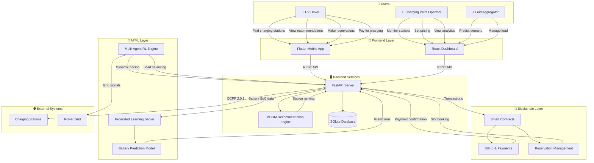
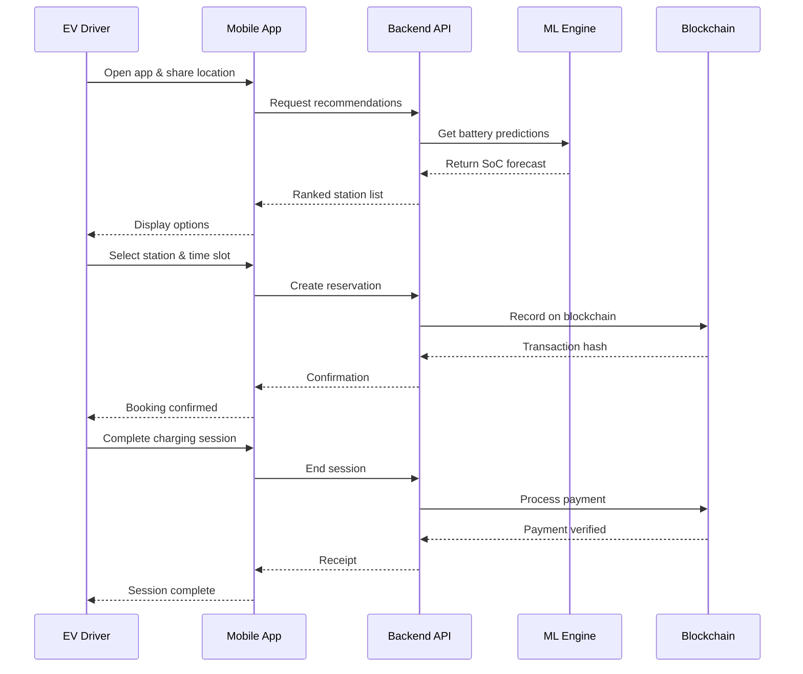
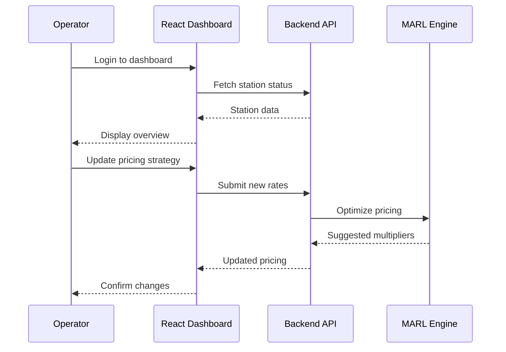

# IEVC-eco User Diagram

## System Actors & Interactions

---

## User Journey Flows

### 🚗 EV Driver Journey

### 🏢 CPO Dashboard Flow

---

## Data Flow Summary

| Actor | Actions | Data Exchanged |
|-------|---------|----------------|
| **EV Driver** | Find stations, Reserve slots, Pay | Location, Battery SoC, Payment info |
| **CPO** | Manage stations, Set prices, Analytics | Station status, Revenue, Usage patterns |
| **Grid Aggregator** | Predict demand, Balance load | Energy forecasts, Grid signals |

